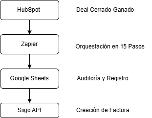
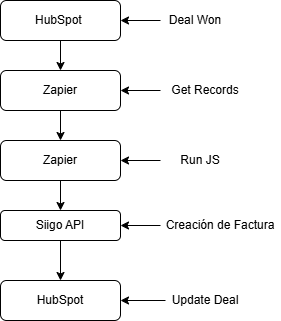

#  Automatización de Facturación: HubSpot → Siigo (vía Zapier)

> Arquitectura de una integración low-code para sincronizar el ciclo de ventas (CRM) con la facturación (ERP) en tiempo real.

## Resumen Ejecutivo

Este proyecto documenta la arquitectura de una integración que conecta **HubSpot CRM** con **Siigo ERP**, utilizando **Zapier** como la plataforma de orquestación (iPaaS). El objetivo principal es la creación automática de una **factura de venta en Siigo** inmediatamente después de que un negocio (deal) se marca como **"Cerrado-Ganado"** en HubSpot.

Esta solución fue diseñada para:
* Eliminar la entrada manual de datos entre sistemas.
* Minimizar errores humanos y asegurar la consistencia de la información.
* Acelerar el ciclo de cobro al facturar instantáneamente.
* Mejorar la alineación estratégica entre los equipos de ventas y contabilidad.

---
## Arquitectura y Flujo de Datos

El flujo sigue una secuencia lógica que extrae, transforma y carga datos desde el CRM al ERP, usando un registro intermedio para auditoría.

Siigo API (Creación de Factura de Venta)

## Flujo de Trabajo Detallado (Versión 1.0)

El Zap inicial se construyó en 15 pasos para asegurar un control granular en cada etapa del proceso.

Fase I: Disparador y Extracción en HubSpot
1. Trigger: Se activa con el cambio de una propiedad en un negocio de HubSpot.
2. Filtro: Valida que la etapa del negocio sea closedwon.
3. Búsqueda de Asociaciones (Contactos): Extrae el ID del contacto principal vinculado.
4. Formateo (Python): Limpia y estandariza el ID del contacto. 
5. Búsqueda de Asociaciones (Productos): Extrae los productos (Line Items) asociados. 
6. Formateo (Python): Normaliza los IDs de los productos.
   
## Fase II: Enriquecimiento y Persistencia de Datos

8. Bucle (Loop): Inicia un proceso para iterar sobre los datos extraídos. 
9. Búsqueda de Contacto: Recupera los datos completos del cliente desde HubSpot (ej: NIF/Cédula). 
10. Obtención de Line Item: Extrae detalles de cada producto (SKU, cantidad, precio). 
11. Registro en Google Sheets: Escribe los datos del cliente y productos en una hoja de cálculo. Propósito: Actúa como un log de auditoría y una capa de persistencia temporal.
    
## Fase III: Autenticación y Carga en Siigo

13. Autenticación (JavaScript): Solicita un access_token a la API de Siigo. Propósito: Autenticar las siguientes peticiones. 
14. Delay: Introduce una breve pausa. Propósito: Prevenir race conditions o exceder los límites de la API de Siigo. 
15. Almacenamiento (Storage): Guarda el token de forma segura para usarlo en el siguiente paso. 
16. Creación de Factura (JavaScript): Un script construye el payload JSON con toda la información y lo envía al endpoint /v1/invoices de Siigo para crear la factura. 
17. Finalización: Un último script para manejar la respuesta y realizar acciones de cierre.
    
---

## Propuesta de Optimización (Versión 2.0)
Tras analizar el flujo inicial, se diseñó una arquitectura optimizada que reduce los pasos de 15 a 5, disminuyendo costos de ejecución y puntos de fallo.

Cambios Clave:

Paso Único de Código: Se consolida toda la lógica (autenticación, construcción de payload y llamada a la API) en un solo paso de "Run Javascript".
Eliminación de Redundancias: Se quitan los pasos intermedios de formateo en Python y el almacenamiento explícito del token.
Eliminación de Google Sheets: Se elimina la dependencia de Google Sheets para la lógica principal, usándolo solo para logging asíncrono si es necesario.
Ciclo Cerrado (Closed-Loop): Se añade un paso final que actualiza el negocio en HubSpot con el número de factura generado en Siigo, ofreciendo trazabilidad completa.
Esta versión 2.0 es más robusta, eficiente y fácil de mantener.

## Tecnologías y Herramientas

Componente	Rol en la Arquitectura
HubSpot	CRM y fuente de datos que inicia el proceso de automatización.
Zapier	Motor de automatización (iPaaS) que orquesta el flujo de integración.
Siigo API	ERP de destino donde se crea la factura de venta.
Code by Zapier	Permite ejecutar lógica personalizada con JavaScript y Python.
Google Sheets	Almacenamiento intermedio para auditoría y registro de transacciones.

## Conclusión

Este modelo de integración demuestra cómo las herramientas low-code/no-code como Zapier pueden conectar sistemas críticos como un CRM y un ERP de forma escalable y auditable. La arquitectura está diseñada para ser eficiente y fácilmente adaptable a futuras necesidades de negocio.

## Autor

Yeison Estiven López
Cali, Colombia

Arquitecto de Automatización e Integraciones RPA

⚠️ Disclaimer: Este repositorio describe una arquitectura de integración con fines demostrativos. No expone código fuente propietario ni credenciales. Todos los ejemplos son conceptuales y no contienen datos sensibles.

